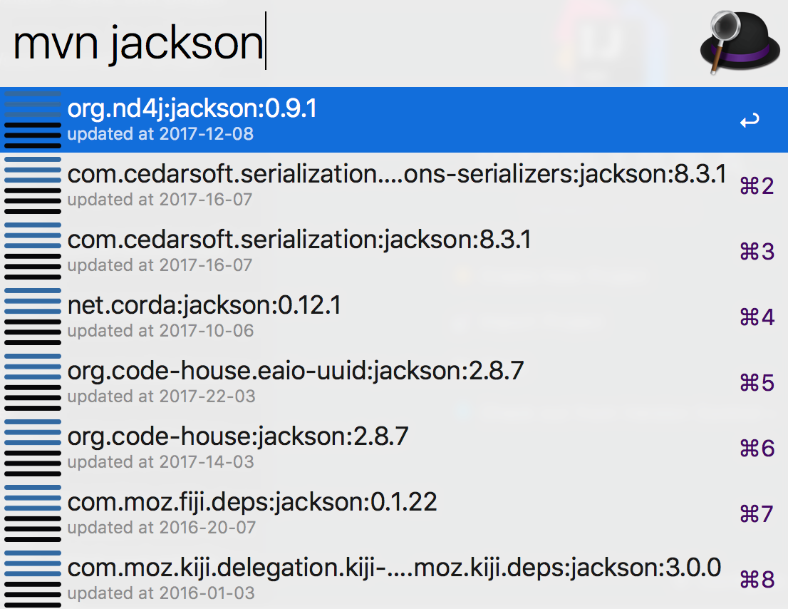

# arvis-mvns
[](https://nodei.co/npm/arvis-mvns/)

## Install

- npm install `npm install -g arvis-mvns`

## Usage

In arvis, type `mvn`, and your query, to search for java libraries at maven central repository.

Select a item and press <kbd>enter</kbd> to copy `maven dependency` to clipboard.<br>

Hold <kbd>alt</kbd> and press <kbd>enter</kbd> to copy `gradle dependency` to clipboard.<br>

## Demo



press <kbd>enter</kbd> get:

```
<dependency>
  <groupId>org.nd4j</groupId>
  <artifactId>jackson</artifactId>
  <version>0.9.1</version>
</dependency>
```
Hold <kbd>alt</kbd> and press <kbd>enter</kbd> get:

```
compile 'org.nd4j:jackson:0.9.1'
```


## License

MIT © 

## 🔗 This workflow is converted from [alfred-workflow](https://github.com/xfslove/alfred-mvns).

* Note that there might be some code change or different actions from the original workflow.

* Marked original workflow's creator to author.
